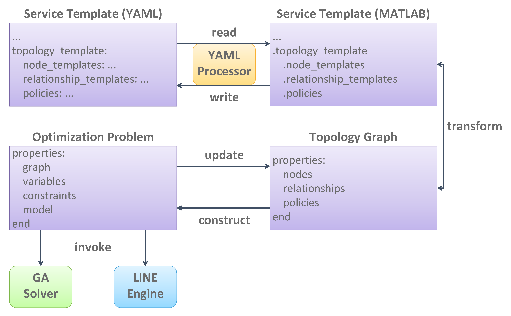

A prototype of the decomposition tool with an initial deployment optimization capability has been implemented. The implementation is based on a set of data structures and external tools as illustrated in the following figure. Given a TOSCA model, the tool uses a built-in YAML processor to import the service template into MATLAB and generates a so-called topology graph through model-to-model transformation. This topology graph embeds a layered queueing network for performance prediction. An optimization problem is then created from the topology graph and solved by invoking the `GA <https://www.mathworks.com/help/gads/genetic-algorithm.html>`_ solver and the `LINE <http://line-solver.sourceforge.net/>`_ engine. When the optimal solution is found, the tool writes the result back into the service template.

